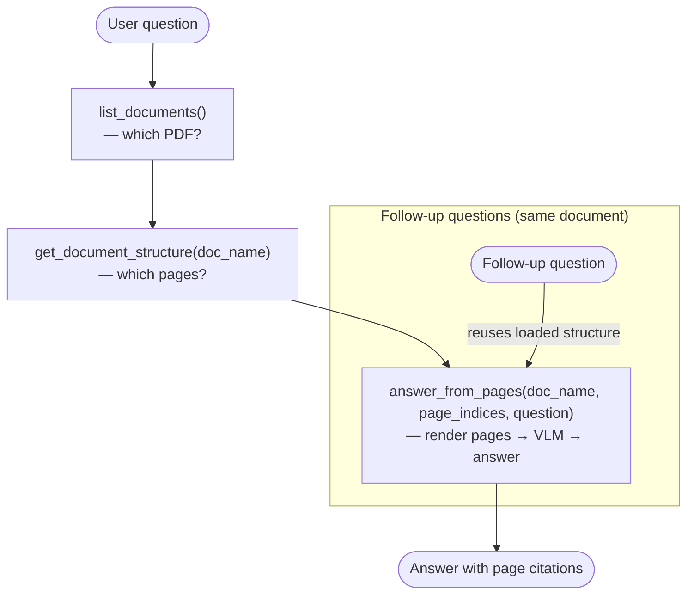

# VLM Agent — Deployment & Usage

## How the agent works

The agent answers questions about indexed PDF documents using a **reasoning-based, vision-first** retrieval loop — no embeddings, no chunking.

When you ask a question, the agent follows three steps:

1. **Discover** — calls `list_documents` to enumerate available PDFs (reads `*.json` files from `PAGEINDEX_RESULTS_DIR`, default `examples/results/`).
2. **Navigate** — calls `get_document_structure(doc_name)` to retrieve the hierarchical table of contents extracted at indexing time. Each node carries a title and a 1-based page range (`start_index`, `end_index`). The agent reasons over this tree to pick the pages most likely to contain the answer.
3. **Read** — calls `answer_from_pages(doc_name, page_indices, question)`. This renders the selected PDF pages as images (via PyMuPDF) and sends them to a vision-capable model along with the question. The answer is grounded in exactly what appears on those pages.

Across multiple turns the agent remembers which document and structure it already loaded, so follow-up questions go directly to `answer_from_pages` without re-navigating the tree.



---

## Prerequisites

| Requirement | Notes |
|---|---|
| Python ≥ 3.12 | managed by `uv` |
| `uv` | package manager — `curl -Ls https://astral.sh/uv/install.sh \| sh` |
| OpenRouter API key | or any OpenAI-compatible provider; model must support **tool calling** and **vision** (e.g. `google/gemini-2.5-flash`) |
| Node ≥ 18 + `pnpm` | only needed to run agent-chat-ui |

---

## Step 1 — Index at least one PDF

The agent reads pre-built index JSONs. The source PDF must sit in the **same directory** as its JSON.

```bash
uv run start-app --pdf-path path/to/document.pdf --output-dir examples/results/
# copies document.pdf → examples/results/ is NOT done automatically
cp path/to/document.pdf examples/results/
```

Or index directly into `examples/results/`:

```bash
uv run start-app --pdf-path examples/results/document.pdf
```

After indexing, `examples/results/` should contain both `document.json` and `document.pdf`.

---

## Step 2 — Configure environment

Copy `.env.example` to `.env` and fill in the required values:

```bash
cp .env.example .env
```

Minimum required fields:

```dotenv
LLM_API_KEY=sk-or-...            # OpenRouter (or your provider's) API key
LLM_MODEL=google/gemini-2.5-flash-preview   # must support tool calling + vision
LLM_BASE_URL=https://openrouter.ai/api/v1   # default; change for other providers
```

Optional — enable Langfuse tracing:

```dotenv
TRACING_ENABLED=true
LANGFUSE_PUBLIC_KEY=pk-lf-...
LANGFUSE_SECRET_KEY=sk-lf-...
LANGFUSE_HOST=http://localhost:3000    # or https://cloud.langfuse.com
```

---

## Step 3 — Start the LangGraph server

```bash
uv run langgraph dev
```

Expected output:

```
INFO     Serving on http://0.0.0.0:2024
INFO     Graph 'agent' loaded
```

> The server hot-reloads when you edit source files under `src/`.

---

## Step 4 — Launch agent-chat-ui

In a separate terminal, clone and start the chat UI:

```bash
git clone https://github.com/langchain-ai/agent-chat-ui /tmp/agent-chat-ui
cd /tmp/agent-chat-ui
pnpm install
NEXT_PUBLIC_API_URL=http://localhost:2024 \
NEXT_PUBLIC_ASSISTANT_ID=agent \
pnpm dev
```

Open **http://localhost:3000** in your browser.

On first load you'll see a connection form — fill in:

| Field | Value |
|---|---|
| Deployment URL | `http://localhost:2024` |
| Assistant / Graph ID | `agent` |

Or pre-fill those via the env vars above and skip the form entirely.

---

## Asking questions

Once connected, type any question about an indexed document:

> *"What is the Earth Mover's Distance and where is it defined?"*

The tool trace panel (right side of the UI) shows each tool call as it happens:

1. `list_documents` → finds available PDFs
2. `get_document_structure` → loads the table of contents
3. `answer_from_pages([2, 3])` → renders pages 2–3, asks the VLM

The final answer cites the page numbers it used.

Follow-up questions reuse the already-loaded structure — no redundant tool calls.

---

## Configuration reference

All settings can be overridden via environment variables or `.env`.

| Variable | Default | Purpose |
|---|---|---|
| `LLM_MODEL` | `google/gemini-2.5-flash-preview` | Model for both agent and VLM calls |
| `LLM_BASE_URL` | `https://openrouter.ai/api/v1` | Provider endpoint |
| `LLM_API_KEY` | — | Required |
| `PAGEINDEX_RESULTS_DIR` | `examples/results` | Where JSONs and PDFs live |
| `PAGEINDEX_VISION_DPI` | `144` | Page image resolution |
| `TRACING_ENABLED` | `false` | Enable Langfuse tracing |
