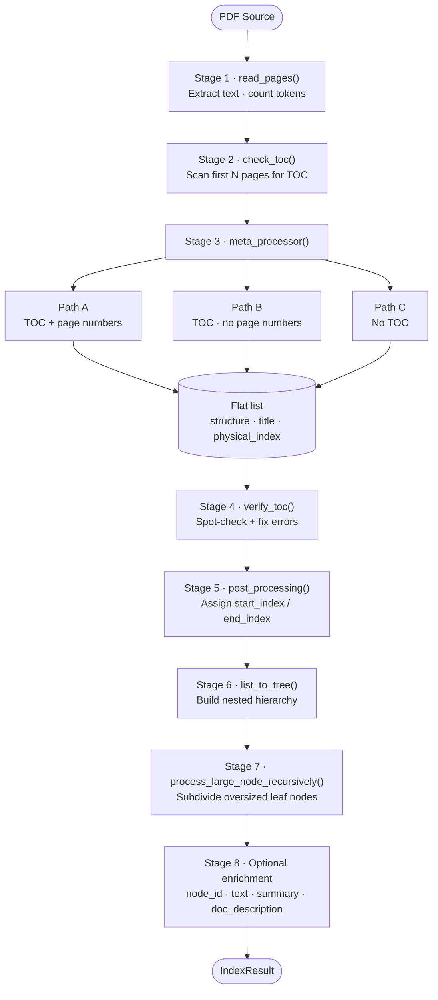
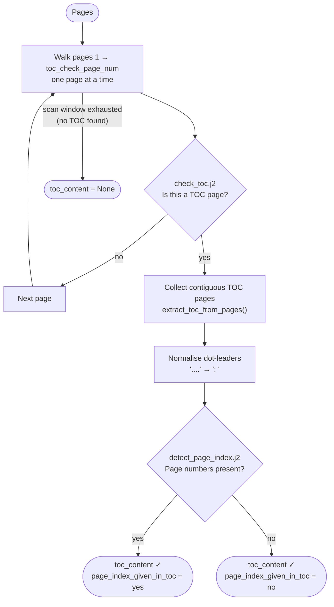
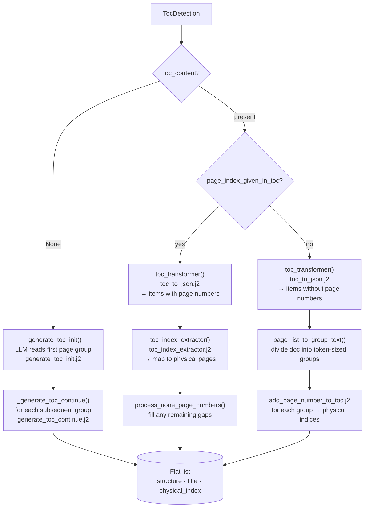
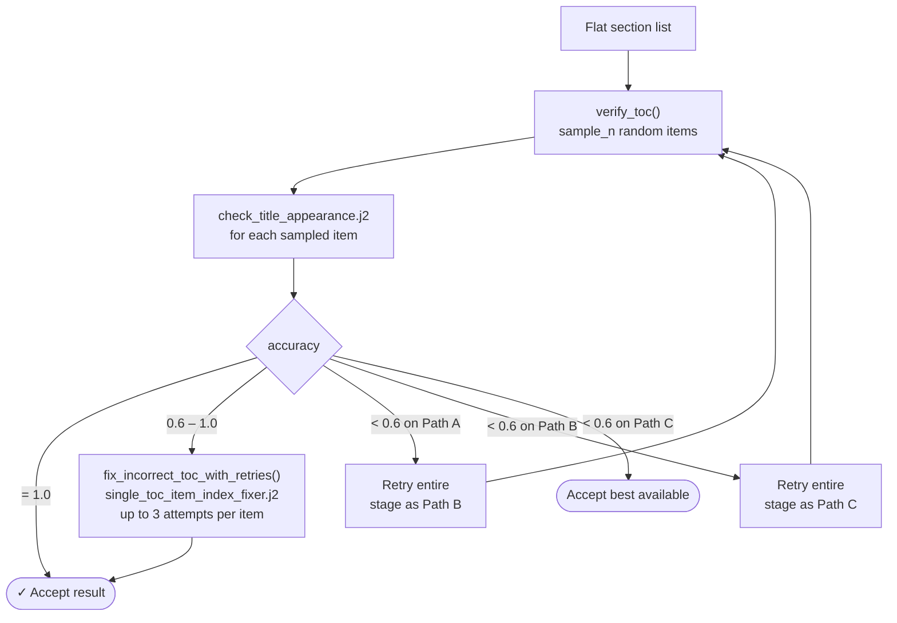
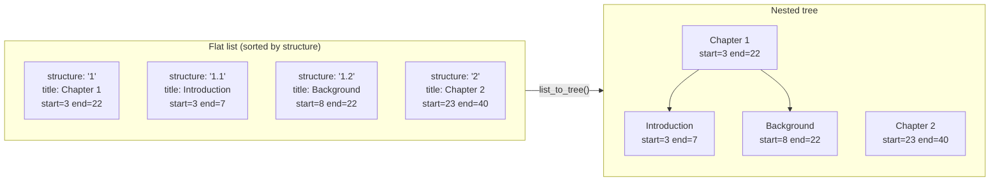
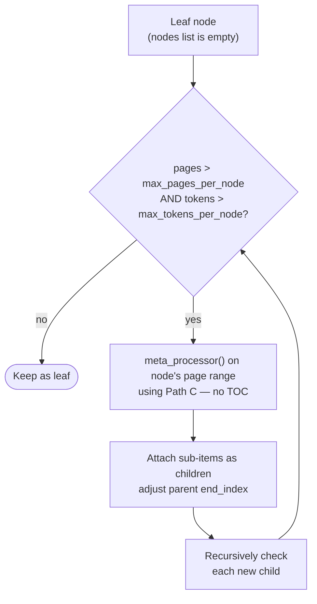

# Document Structure Generation

This document explains how the system builds a hierarchical section tree from a PDF. The pipeline is reasoning-based: an LLM interprets the document's layout rather than using embeddings or heuristics.

---

## Overview

The entry point is `page_index()` in [pipeline.py](../src/rag_pageindex/pageindex/pipeline.py). It accepts a PDF (path, `BytesIO`, or URL string) and an `LLMClient`, and returns a dict with `doc_name` and `structure` — a nested list of section nodes.



The `structure` field of `IndexResult` is a list of root-level `TreeNode` dicts. Each node carries `title`, `start_index`, `end_index`, an optional `node_id`, and a `nodes` list of children.

---

## Stage 1 — PDF Reading

**Module:** [pdf/reader.py](../src/rag_pageindex/pageindex/pdf/reader.py)

`read_pages(source, llm)` extracts the text of every page using PyPDF2 (default) or PyMuPDF, then asks the LLM client to count tokens for each page. The result is an ordered `list[Page]`, where each `Page` is a frozen dataclass holding:

- `text: str` — raw extracted text
- `token_length: int` — token count as reported by the LLM's tokenizer

Page indices throughout the pipeline are **1-based** and match PDF page numbers.

`get_text_of_pages(pages, start, end, with_labels=False)` concatenates a page range. When `with_labels=True` it wraps each page in `<physical_index_N>` tags, which the LLM uses as anchors when locating sections.

---

## Stage 2 — TOC Detection

**Module:** [toc/detection.py](../src/rag_pageindex/pageindex/toc/detection.py)

`check_toc(pages, toc_check_page_num, llm)` scans the first `toc_check_page_num` pages (default 20, controlled by `PAGEINDEX_TOC_CHECK_PAGE_NUM`) looking for a Table of Contents. It returns a `TocDetection` dataclass:

| Field | Type | Meaning |
|---|---|---|
| `toc_content` | `str \| None` | Raw text of the TOC, or `None` if absent |
| `toc_page_list` | `list[int]` | Page indices that contain TOC text |
| `page_index_given_in_toc` | `"yes" \| "no"` | Whether page numbers appear in the TOC |

**How detection works:**

1. `find_toc_pages()` walks forward page by page, calling `toc_detector_single_page()` on each. That function sends the page text to the LLM via the `check_toc.j2` prompt and gets back `"yes"` or `"no"`. Scanning stops after the last contiguous TOC page.

2. `extract_toc_from_pages()` concatenates all TOC pages, normalises dot-leader separators (`....` and `. . . .` → `: `), and calls `detect_page_index.j2` to determine whether page numbers are present.

3. If the TOC is found but has no page numbers, the scan continues further into the document in case additional TOC pages appear later.



The `TocDetection` result drives the routing decision in Stage 3.

---

## Stage 3 — Building the Flat Section List

**Module:** [toc/parsing.py](../src/rag_pageindex/pageindex/toc/parsing.py), coordinated by `meta_processor()` in [tree/builder.py](../src/rag_pageindex/pageindex/tree/builder.py)

The goal of this stage is a flat list of dicts, one per section, each with:

- `structure` — dotted hierarchy index (`"1"`, `"1.2"`, `"1.2.3"`, …)
- `title` — section heading
- `physical_index` — 1-based PDF page where the section begins

There are three paths depending on what `check_toc` found:



### Path A — TOC with page numbers

Used when `toc_content` is set and `page_index_given_in_toc == "yes"`.

1. **`toc_transformer(toc_content, llm)`** — sends the raw TOC text to `toc_to_json.j2`, which asks the LLM to emit a JSON array like:
   ```json
   [{"structure": "1.2", "title": "Background", "page": 14}, …]
   ```
   If the TOC is long and the model's output is truncated (`finish_reason == "max_output_reached"`), a continuation prompt is sent until the full list is obtained.

2. **`toc_index_extractor(toc_items, pages, llm)`** — the parsed items include the page numbers from the TOC text, but those numbers may not match physical PDF pages (e.g. front matter, roman numerals). This function sends a window of tagged document pages to `toc_index_extractor.j2` and asks the LLM to match each item to a `<physical_index_N>` tag, yielding the true page offset.

3. **`process_none_page_numbers()`** — for any items still missing a `physical_index` after step 2, the function narrows the search window between neighbouring known indices and calls `add_page_number_to_toc.j2` to locate them.

### Path B — TOC without page numbers

Used when `toc_content` is set and `page_index_given_in_toc == "no"`.

1. `toc_transformer()` still parses the TOC structure into JSON items (without `page` fields).

2. **`page_list_to_group_text()`** divides the entire document into overlapping text groups that each fit within the token budget. Groups overlap by one page so sections near group boundaries are not missed.

3. For each group, **`add_page_number_to_toc.j2`** asks the LLM to identify which `<physical_index_N>` tag each section title first appears at. Results accumulate until all items have a `physical_index`.

### Path C — No TOC

Used when `toc_content` is `None`.

The LLM builds the section structure from scratch by reading the document directly.

1. **`_generate_toc_init()`** sends the first group of pages to `generate_toc_init.j2`, which asks the LLM to identify section titles and their starting pages, returning items with `structure`, `title`, and `physical_index`.

2. **`_generate_toc_continue()`** sends subsequent groups along with the already-found items to `generate_toc_continue.j2`, which extends the list. This continues group by group until the end of the document.

---

## Stage 4 — Verification and Correction

**Module:** [toc/verification.py](../src/rag_pageindex/pageindex/toc/verification.py)

After any of the three paths, `meta_processor()` calls `verify_toc()` to spot-check accuracy.

`verify_toc(pages, items, start_index, sample_n, llm)` samples `sample_n` items at random and, for each, calls `check_title_appearance.j2` — a fuzzy prompt that asks whether the given title visibly appears on or near the given page. It returns:

- `accuracy: float` — fraction of checked items that passed
- `incorrect_items: list` — the ones that failed

If `accuracy < 1.0`, `fix_incorrect_toc_with_retries()` attempts to locate the correct page for each failed item using `single_toc_item_index_fixer.j2`, which searches a window around the erroneous index. Up to 3 attempts are made per item.



**Fallback escalation summary:**

| Accuracy | Action |
|---|---|
| 1.0 | Accept result |
| 0.6 – 1.0 | Fix individual incorrect items and accept |
| < 0.6 with path A | Retry as path B |
| < 0.6 with path B | Retry as path C |
| < 0.6 with path C | Accept best available result |

---

## Stage 5 — Page Range Assignment

**Function:** `post_processing()` in [tree/builder.py](../src/rag_pageindex/pageindex/tree/builder.py)

The verified flat list has `physical_index` (section start) but not end pages. `post_processing()` computes `start_index` and `end_index` for each item by examining what comes next.

Concurrently, `check_title_appearance_in_start.j2` checks whether each section's title appears at the very beginning of its page and stores the result in the `appear_start` field (`"yes"` or `"no"`). This determines whether the current section's last page belongs wholly to the next section or is shared.

- **`start_index`** = `physical_index` of this item
- **`end_index`** logic:
  - If next item's `appear_start == "yes"`: `end_index = next.physical_index − 1`
  - Otherwise: `end_index = next.physical_index`
  - For the last item: `end_index = total_page_count`

If the first section doesn't begin at page 1, `add_preface_if_needed()` inserts a synthetic "Preface" node covering pages 1 through `first_section.physical_index − 1`.

---

## Stage 6 — Tree Construction

**Function:** `list_to_tree()` in [tree/builder.py](../src/rag_pageindex/pageindex/tree/builder.py)

The flat list is sorted by the `structure` field and converted to a nested tree. Each item's parent is determined by `_parent_structure()`, which strips the last dotted segment (e.g. `"1.2.3"` → `"1.2"`). Items with no parent (depth-1 items like `"1"`, `"2"`) become roots; all others are appended to their parent's `nodes` list.



The result is a list of root `TreeNode` dicts:

```json
{
  "title": "Chapter 1",
  "start_index": 3,
  "end_index": 22,
  "nodes": [
    {"title": "1.1 Introduction", "start_index": 3, "end_index": 7, "nodes": []},
    {"title": "1.2 Background",   "start_index": 8, "end_index": 22, "nodes": []}
  ]
}
```

---

## Stage 7 — Recursive Node Splitting

**Function:** `process_large_node_recursively()` in [tree/builder.py](../src/rag_pageindex/pageindex/tree/builder.py)

Leaf nodes that have no children but span more than `PAGEINDEX_MAX_PAGES_PER_NODE` pages **and** more than `PAGEINDEX_MAX_TOKENS_PER_NODE` tokens are treated as oversized. This can happen when path C generates coarse-grained structure for a dense chapter.



Splitting terminates when a node is within the size thresholds or has no room to subdivide further.

---

## Stage 8 — Optional Enrichment

Controlled by settings flags; all default to `False` except `PAGEINDEX_ADD_NODE_ID`.

| Flag | Default | What it adds |
|---|---|---|
| `PAGEINDEX_ADD_NODE_ID` | `true` | Zero-padded `node_id` in depth-first pre-order (e.g. `"001"`, `"002"`) |
| `PAGEINDEX_ADD_NODE_TEXT` | `false` | `text` field: concatenated raw page text for the node's range |
| `PAGEINDEX_ADD_NODE_SUMMARY` | `false` | `summary` field: LLM-generated paragraph describing the node's content |
| `PAGEINDEX_ADD_DOC_DESCRIPTION` | `false` | `doc_description` key at the top level: one-sentence overview of the document |

Summaries are generated concurrently across all nodes using `asyncio.gather()`.

---

## Key Data Types

### In-flight: `TocItem` (TypedDict)

Used throughout parsing stages. Fields are added incrementally; not all are present at every stage.

```python
class TocItem(TypedDict, total=False):
    structure: str          # dotted hierarchy index
    title: str
    page: int               # page number from TOC text (may differ from physical)
    physical_index: int     # 1-based PDF page
    start_index: int        # same as physical_index after post_processing
    end_index: int
    appear_start: str       # "yes" | "no"
    list_index: int         # position in flat list (used during verification)
    node_id: str
    text: str
    summary: str
    nodes: list[TocItem]
```

### Output: `TreeNode` (Pydantic)

```python
class TreeNode(BaseModel):
    title: str
    start_index: int
    end_index: int
    node_id: str | None = None
    summary: str | None = None
    text: str | None = None
    nodes: list[TreeNode] = []
```

### `IndexResult` (Pydantic) — top-level output schema

```python
class IndexResult(BaseModel):
    doc_name: str
    doc_description: str | None = None
    structure: list[dict[str, Any]]
```

---

## LLM Interface

All LLM calls go through `LLMClient` ([llm/protocol.py](../src/rag_pageindex/pageindex/llm/protocol.py)), a structural Protocol:

```python
class LLMClient(Protocol):
    model: str
    def complete(messages, temperature, max_tokens) -> LLMResponse: ...
    async def acomplete(messages, temperature, max_tokens) -> LLMResponse: ...
    def complete_structured(messages, response_model: type[T], ...) -> T: ...
    async def acomplete_structured(messages, response_model: type[T], ...) -> T: ...
    def count_tokens(text: str) -> int: ...
```

`LLMResponse` carries `content: str` and `finish_reason: "finished" | "max_output_reached" | "error"`. The pipeline inspects `finish_reason` to detect truncation and issue continuation prompts.

Structured completions (`complete_structured` / `acomplete_structured`) use Pydantic models to guarantee the JSON schema of responses, replacing the tolerant JSON parser used in earlier pipeline versions.

---

## Prompt Templates

Every prompt is a Jinja2 template under [prompts/](../src/rag_pageindex/pageindex/prompts/) and rendered via `prompts.render("name.j2", **ctx)`. The Jinja environment uses `StrictUndefined`, so a missing context variable raises at render time rather than silently producing empty output.

| Template | Stage | Purpose |
|---|---|---|
| `check_toc.j2` | TOC detection | Is this page a Table of Contents? |
| `detect_page_index.j2` | TOC detection | Does the TOC contain page numbers? |
| `extract_toc_content.j2` | TOC detection | Extract verbatim TOC text (with continuation) |
| `toc_to_json.j2` | Path A & B parsing | Parse TOC text to structured JSON |
| `toc_index_extractor.j2` | Path A parsing | Map TOC page numbers to physical PDF pages |
| `add_page_number_to_toc.j2` | Paths B & A gap-fill | Locate section starts in a tagged page window |
| `generate_toc_init.j2` | Path C parsing | Build initial section list from document text |
| `generate_toc_continue.j2` | Path C parsing | Extend section list with subsequent pages |
| `check_title_appearance.j2` | Verification | Does this title appear near this page? (fuzzy) |
| `check_title_appearance_in_start.j2` | Stage 5 | Does this title appear at the START of this page? |
| `single_toc_item_index_fixer.j2` | Error correction | Find the correct page for a mislocated section |
| `generate_node_summary.j2` | Enrichment | Summarise a section's text |
| `generate_doc_description.j2` | Enrichment | One-sentence document overview |

---

## Configuration Reference

All tuning knobs are fields on `Settings` in [core/config.py](../src/rag_pageindex/core/config.py) and can be set via environment variables or `.env`.

| Variable | Type | Default | Effect |
|---|---|---|---|
| `PAGEINDEX_TOC_CHECK_PAGE_NUM` | int | 20 | How many pages to scan for a TOC |
| `PAGEINDEX_MAX_PAGES_PER_NODE` | int | 10 | Leaf node size threshold (pages) for recursive splitting |
| `PAGEINDEX_MAX_TOKENS_PER_NODE` | int | 20 000 | Leaf node size threshold (tokens) for recursive splitting |
| `PAGEINDEX_TOKEN_CEILING` | int | 110 000 | Maximum total tokens the pipeline will process |
| `PAGEINDEX_TOC_MAX_OUTPUT_TOKENS` | int | 16 000 | Max output tokens for TOC parsing LLM calls |
| `PAGEINDEX_ADD_NODE_ID` | bool | true | Attach zero-padded `node_id` to every node |
| `PAGEINDEX_ADD_NODE_SUMMARY` | bool | false | Generate per-node summaries (expensive) |
| `PAGEINDEX_ADD_NODE_TEXT` | bool | false | Attach raw page text to every node |
| `PAGEINDEX_ADD_DOC_DESCRIPTION` | bool | false | Generate a top-level document summary |
